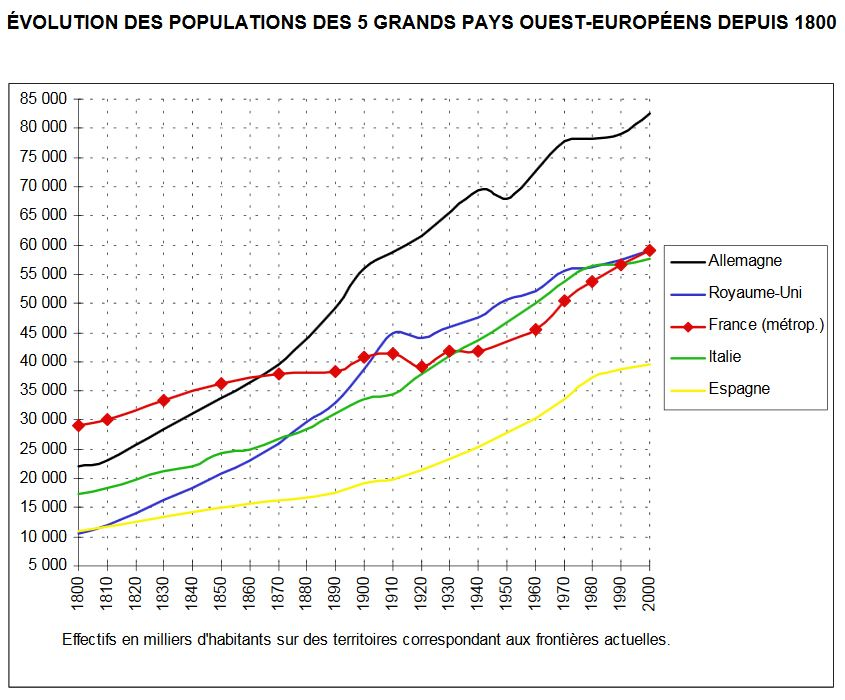
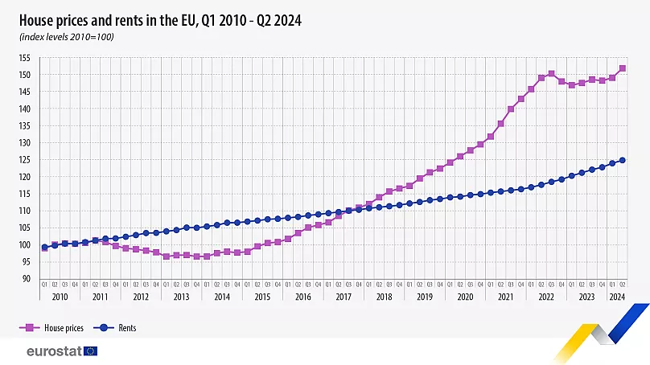
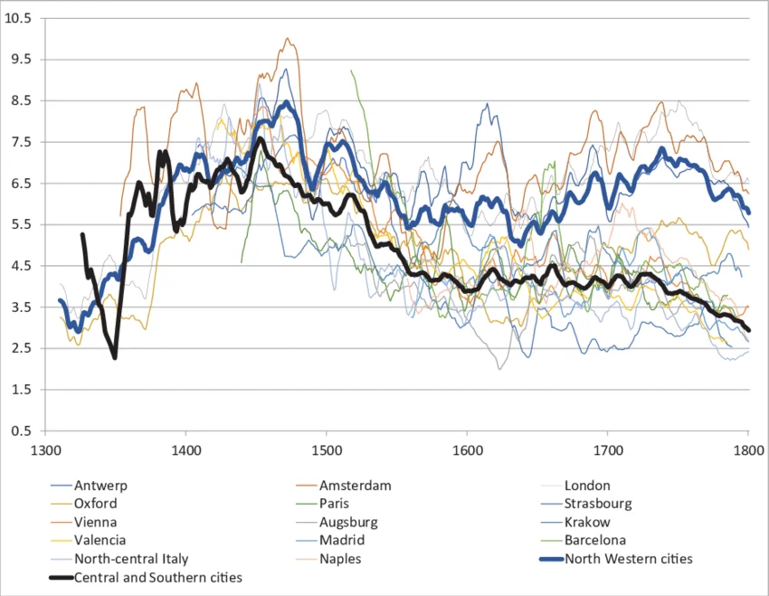

## Uvod
Porazdelitev bogastva je bila v 19. stoletju tako kot danes konfliktna tema. Nekateri (Kuznets) so verjeli, da bo tehnološki napredek vodil do manjšanja razlik med sloji, drugi (Marx) pa do kopičenja bogastva v lasti manjšine. Trenutno stanje je pokazalo, da se ni uresničila ne "marksistična apokalipsa", ne utopija enakosti. Danes se znajdemo v podobni situaciji kot v kateri so bili na koncu 19. stoletja, kjer se obširna rast v tehnološkem napredku ni izrazila v izboljšanem materialnem izobilju in življenskih pogojih večine. Sistem, ki mehansko producira arbitrarne neenakosti, postavlja pod vprašaj osnovne vrednote meritokracije, v katere naša družba verjame. Namen te knjige je izpostaviti tehnike s katerimi lahko demokracija in interes skupnega dobrega znova vzpostavita red nad tem ekonomskim sistemom. 

<figure>
  
  <figcaption>Thomas Piketty</figcaption>
</figure>

## Presoja brez virov?
Pogosto se družboslovnim analizam očita, da so premalo znanstvena in polna predsodkov. V nasprotje želi avtor pokazati, da lahko inuitivno znanje služi kot močna osnova za analizo sveta. Film in literatura, npr. ta iz 19. stoletja, z veliko natančnostjo izžareva socialne strukture takratnega časa, neenakosti in posledice teh na posamenzika. "Trdna in telesna resničnost neenakosti se ponuja v pogled vsem, ki v ali ob njej živijo in naravno daje snov politični presoji teh za in proti. Vprašanje porazdelitve bogastva bo zmeraj imelo samosvojo dimenzijo subjektivnega in psihološkega."

A hkrati, ob pomanjkanju sistematične analize problema lahko le ta vodi do take in drugačne rešitve. Za nekatere je neenakost ves čas v vzponu, med tem ko lahko za druge pada ali je v čas v svojem stanju pravega ekvilibrija. Spreten pristop k problemu ne bo nikoli rešil nasilnih političnih konfliktov, ki so posledica neenakosti. "Potrpežljiva izpostava dejstev in resnic, jasna analiza raznih mehanizmov se vrednoti v izboljšavi boljše izobraženi javni razpravi in bolje postavljenim vprašanjem. Predela lahko definicije v sporu, pokaže laži zamaskirane kot resnice in obratno."

<figure>
  
  <figcaption>Honoré Balzac - Oče Goriot </figcaption>
</figure>

## Malthus, Young in francoska revolucija
Začetek 19. stoletja je napovedoval novo ekonomsko realnost z veliko rastjo prebivalstva, ki se je selila iz podeželja v nova industrijska mesta. Thomas Malthus je v tem videl veliko grožnjo, namreč v prenaseljenosti prostora, kjer se je opiral na angleškega agronoma Arthur Younga. Ta je svoj čas preživel v Franciji, ki je bila takrat primerljivo največja država v Evropi po številu prebivalcev, 20 milijonov proti 5 v Angliji. Med drugim je ta demografska eksplozija vodila k slabšanju materialnih razmer dninarjev, ki je skupaj z rastjo davkov vodila do leta 1789. Young, podobno kot mnogi danes, ni mogel uiti danosti svojega ekonomskega razreda. Največjo napako v francoskem političnem sistemu je videl v tem, da je lahko plemstvo in meščanstvo sedelo v istem parlamentu (v nasprotju z dvema domovoma v Angliji). Malthus se Youngu pridruži v analizi stanja in porazdelitve. Zanj je sprememba oblasti v Franciji nepredstavljiva in vidi v nižjih slojih nevarno opozicijo, ki bi ji morali takoj odvzeti vso podporo. Pomembneje, omejiti bi jim morali tudi možnost rodnosti.

<figure>
  
  <figcaption>Primerjava med državami v rasti prebivalstva skozi stoletja</figcaption>
</figure>

## Ricardo, načelo redkosti
Konec 18. stoletja je bil za pripadnike višjega razreda, torej za skoraj vse vse vidne intelektualce tistega časa - travmatizirajoč. Nenadne socialne in ekonomske spremembe so mnoge vodile misliti, da je prihodnost človeških struktur temačna. Med njima sta omenjena David Ricardo in Karl Marx. Prvi je verjel, da se bo bodoče bogastvo koncentriralo pri lastnikih zemlje, drugi pa da kapitalističnih podjetnikih. Skupno jima je bilo mnenje, da se bodo ti polastili vedno večjega deleža prihodka.

Po Ricardu je šel argument tako: ljudje živijo in delajo na zemlji in več kot je ljudi, večja bo potreba po njej, odvisnost, ki bo vodila v rast njene cene. Od tega pa bodo večinsko bogateli lastniki zemlje, ostali pa v njihovi nemilosti. Za njega je rešitev pred bodočo ekonomsko neenakostjo predstavljal davek na lastnino zemlje. Danes vemo, da se njegova napoved ni uresničila (v celoti). Vrednost zemlje je v primerjavi z drugimi bogastvi naraščala počasneje, prav tako pa kmetje - njeni lastniki - danes ne predstavljajo dominantne strukture. Podobno kot Malthusa in Younga ga je omejevala domišljija pri človeški sposobnosti se osamosvojiti obveze pridelavi hrane.

Načelo redkosti, ki ga je vpeljal, ni nepomemben. Izraža nevarnost, da lahko lastniki neke iskane a redke dobrine to izkoristijo za višanje cen, od katere lahko neizmerno obogatijo. "Ta ideja ne pozna ne meje ne etike." S koordiniranjem dejanj skoraj vsakega danes živega pa lahko v svojem ekstremu pripelje do nevarnih družbenih stanj. Če Ricardovo dobrino poljedelske zemlje zamenjamo z nepremičninami ali gorivom, pridemo do enakih socialnih in ekonomskih neenakosti, ki lahko vodijo v razpad družbe.     

<figure>
  
  <figcaption>Ustvarjanje dobičkov z neizogibno potrebo</figcaption>
</figure>

## Marx: načelo nenehnega kopičenja
Do časa Marxa se je problem vidno spremenil. Države so bile zmožne pridelati dovolj hrane za svoje prebivalstvo, hkrati pa cene poljedeljske zemlje niso apokaliptično narasle. Dejstvo pa je postajalo vedno bolj očitno, da hitro rastoče množice ljudi živijo v ekstremno bednih pogojih, v nasprotju z neverjetno produktivno rastjo nove industrije, ki so jo pomagali soustvarjati. Plače delavcev so v primerjavi s prejšnjimi stoletji stagnirale ali celo padale, do kakršnega koli opazne rasti njihovih plač je prišlo komaj ob koncu 19. stoletja. Trenutek pa ni spremenil ogromne neenakosti, ki je veljala v zahodnih državah vse do časa prve svetovne vojne. V takšnih pogojih so se razvijale prve socialistične ideje z osnovnim vprašanjem: "Kakšnemu namenu služi industrijska rast, tehnološki napredek, težaško delo in selitve v mesta, če ostane stanje množic enako slabo kot brez te?" 

Kaj je lahko reči o dolgoročnosti takšnega sistema? Po Marxu je odgovor: "Razvoj velike industrije pod nogami svoje buržoazije spodkopava taista tla na katerih je zgradila svoj sistem produkcije in prisvajanja. Meščanstvo si postavlja svoje lastne grobarje." Marx se od Ricardove ideje redke dobrine loči s tem, da sodi kapital predvsem po svoji industrijski, fizični obliki, nevezan na zemljo. S tem je neskončen in tako tu kopičenje tega. Zanj sta posledici lahko le dve, in obe slabi - ali se bo rast upočasnili in vodila do tega, da se kapitalisti med seboj raztrgajo; ali pa bo nenehna rast neenakosti vodila do povezave delastva in revolucije. Ekvilibrij je nemogoč.

Ta analiza je lahko v današnjem času, s stabilno gospodarsko rastjo, a vedno večjo rastjo neenakosti enako relevantna, take, ki ni apokaliptična pa tudi ne neodmisljiva - nevarna za socialno stabilnost družbe.   

<figure>
  
  <figcaption>Padec povprečne plače ob začetku industrijske revolucije</figcaption>
</figure>      

## <u>Nouveaux mots:</u>
1. balbutiant(e) - adj. - jecljajoč; 
2. silloner - v. - prečkati;          
3. foncier(ère) - adj. - zemljiški; 
4. la déflagration - n. f. - vzplamtenje;
5. l'auberge - n. f. - gostišče; 
6. aboutir - v. - doseči, priti do sklepa; 
7. quoique - conj. - četudi; 
8. en dépit - n. m. - kljub;
9. s'entasser - v. - kopičiti se;
10. le taudis - n. m. - bedno stanovanje, "luknja";
11. sordide - adj. - umazan, ogaben; 
12. le recul - n. m. - razdalja, oddaljitev;
13. le labeur - n. m. - naporno delo;
14. s'atteller - v. - resno se lotiti; 
15. traquer - v. - preganjati; 
16. saper - v. - spodkopati;
17. le fossoyeur - n. m. - grobar;
18. l'échéance - n. f. - dan odločitve;
19. attardé(e) - adj. - zaostal;
20. le raccourci - n. m. - povzetek; 
21. hâtif/ive - adj. - prenagel;
22. le pertinence - n. f. - umestnost;
23. perturbant(e) - adj. - vznemirljiv; 
